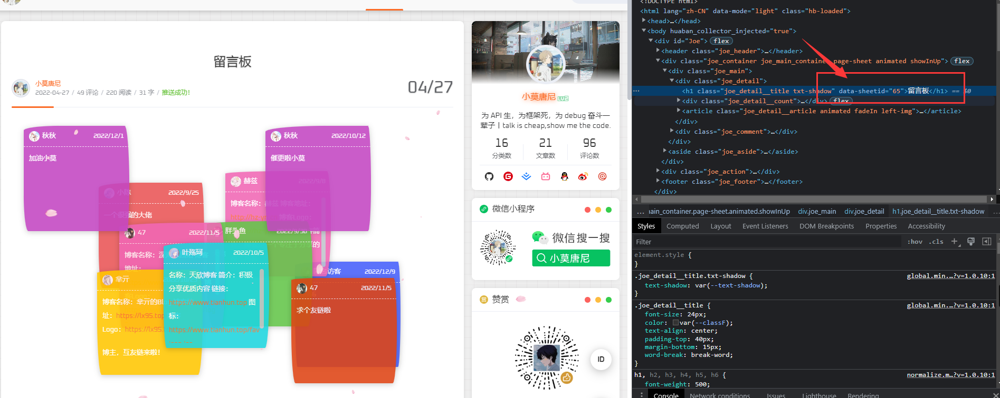

# 修改配置

配置项目的启动运行信息，该配置非常的重要

## 一、留言板设置

留言板是一个比较特殊的配置，需要您手动在 PC 端的博客中获取页面的 `data-sheetid`，具体的操作如下：
<br/>

- 1、打开你的博客并且打开到`留言板`的页面
- 2、`f12`打开`控制台`检查元素，找到 `data-sheetid`，并且复制该值
- 3、找到`uni-halo`项目根目录下的`config/sheets.config.js`文件，将刚才的 id 粘贴到 `留言板页面ID` 的地方

<br/>
图示：



## 二、博客信息配置

按字段描述配置对应的信息即可，若有不明白的可以 [添加 QQ 群](/desgin/introduction.html#交流反馈) 进行咨询

```javascript
export default {
  showCopyright: true, // 显示开源版权信息
  showAbout: true, 		 // 显示关于项目入口
  uni_halo_logo: 'https://b.925i.cn/uni_halo/uni_halo_logo.png', // uni-halo的logo

  // Api基础域名 [必填] ：你的Halo博客基础域名
  apiUrl: '',
	 // Api认证key [必填]： Halo中-系统-博客设置-切换到高级选项-API设置-Access key
  apiAuthorization: '',
  // 博客标题 [建议必填]：在某些页面没有设置具体的页面名称时候，使用该值显示
  title: '',
  // 小程序的太阳码/二维码的图片地址 [建议必填]：主要用于文章详情页面的生成海报的功能
  miniCodeImageUrl: '',
  // 关于页面中的资料卡背景图 [建议必填]
  aboutProfileImageUrl: '',

  // 启动页面的配置（页面地址`/pagesA/start/start`）
  start: {
    use: true, // 是否使用首次启动页：用户第一次使用你的应用会显示否则不显示
    title: 'uni-halo', // 启动页面中的文字标题
    bg: '', // 留空则使用默认 开屏首页背景，可以是颜色值或者图片图片地址
    logo: 'https://b.925i.cn/uni_halo/uni_halo_logo.png', // logo
    desc1: '全新UI，准备出发', // 描述信息1
    desc2: '新触动 新感受 新体验', // 描述信息2
    btnText: '全新出发' // 按钮文字
  },

  author: { // 博主信息
    use: true, // 是否启用这里配置的信息，若设置为false 则启用PC端博客设置的信息
    name: '', // 博主姓名
    avatar: '', // 博主头像
    blog: '', // 博客地址
    email: '' // 博主邮箱
  },

  // 版权信息（用于文章详情）
  copyright: {
    use: true, // 是否使用版权描述
    author: '', // 版权归属说明
    description: '', // 版权描述
    violation: '', // 侵权处理说明
  },

  // 社交信息(将会在`/pagesA/contact/contact`页面中展示)
  // 具体的某个参数值留空则不展示
  social: {
    qq: "", 		 	// qq号
    wechat: "",   // 微信号
    weibo: "",    // 微博地址
    email: "",		// 邮箱地址
    blog: "",			// 博客地址
    juejin: "",		// 掘金地址
    bilibili: "", // b站地址
    gitee: "",		// gitee地址
    github: "",		// github地址
    csdn: ""			// CSDN地址
  },

  // 默认封面 [建议必填]：文章列表的默认封面图的地址，可以是固定图片也可以是随机图api接口
  defaultThumbnailUrl: '',

  // 默认图片 [建议必填]：图片加载失败时候的默认图片，可以是固定图片也可以是随机图api接口
  defaultImageUrl: '',

  // 默认头像 [建议必填]：主要用于评论留言的头像地址，可以是固定图片也可以是随机图api接口
  defaultAvatarUrl: '',

  // 图片加载中的地址 [建议必填]
  loadingGifUrl: '',

	 // 图片加载失败的地址 [非必填]：文章详情页面，文章图片加载失败时候的图片
  loadingErrUrl: '',

  // 加载图片为空地址 [非必填]
  loadingEmptyUrl: '',

  // 底部导航下的 关于 页面波浪图片 [非必填]
  waveImageUrl: '',

  // 轮播图配置
  banner: {
    // 轮播图数据源，可选源：
    // list   =下方配置
    // article=热门文章
    type: 'article',
    list: [],
  },

  quickNav: { // 快捷导航配置
    use: true,
    list: [{
      icon: 'halocoloricon-classify',
      text: '文章归档',
      iconSize: 60,
      color: 'blue',
      type: 'page',
      path: '/pagesA/archives/archives'
    },
    {
      icon: 'halocoloricon-attent',
      text: '恋爱日记',
      iconSize: 60,
      color: 'blue',
      type: 'page',
      path: '/pagesA/love/love'
    },
    {
      icon: 'halocoloricon-calendar',
      text: '个人日记',
      iconSize: 60,
      color: 'blue',
      type: 'page',
      path: '/pagesA/journal/journal'
    },
    {
      icon: 'halocoloricon-message',
      text: '留言板',
      iconSize: 60,
      color: 'blue',
      type: 'page',
      path: '/pagesA/leaving/leaving'
    }
    ]
  },

  // 微信分享信息
  wxShareConfig: {
    title: '', // 小程序分享标题[非必填]
    desc: '', // 小程序分享描述[非必填]
    imageUrl: '', // 小程序分享时候图片地址[非必填]
    path: '/pages/index/index', // 分享路径[非必填] - 基本不需要修改
    copyLink: '/pages/index/index', // 复制链接[非必填]  - 基本不需要修改
    query: {}, // 分享参数[非必填]  - 基本不需要填写
  },
}
```

## 三、广告配置

如果没有广告或者不熟悉，请把`true`都设置为 `false` 即可，目前广告暂未完善

```javascript
export default {
  adpid: '', // uni-AD App广告位id，在uni-AD官网申请广告位
  unitId: '', // 广告单元id，可在小程序管理后台的流量主模块新建 (非个人资质，小程序后台广告主开通申请)
  frequency: 8, // 列表中，广告出现的频率（8=每8条数据出现一次广告）
  // 首页广告
  home: {
    use: true,
  },
  // 文章列表广告
  articles: {
    use: true,
  },
  // 文章详情广告
  articleDetail: {
    use: true, // 是否启用
  }
}
```

## 四、恋爱日记配置

##### 1. 删除功能

::: tip 提示
如果不需要恋爱日记功能，则不需要修改这些配置，并且可以在 [二、博客信息配置](#二、博客信息配置) 中的 `quickNav` 将恋爱日记的代码注释掉或者删除。
:::

```javascript
// 删除的代码
{
 	icon: 'halocoloricon-attent',
 	text: '恋爱日记',
 	iconSize: 60,
 	color: 'blue',
 	type: 'page',
  path: '/pagesA/love/love'
},

```

##### 2. 开始配置

如果不需要恋爱日记，可以在`config/halo.config.js`中的`quickNav`中注释掉，
具体配置，自行查看文件内容，对应的图片可以在下方的默认配置中下载到本地上传到你的服务器后替换

```javascript
export default {
  waveImageUrl: 'https://b.925i.cn/uni_halo/uni_halo_about_wave.gif', // 波浪图片地址
  bgImageUrl: 'https://b.925i.cn/uni_halo_love/love_bg1.png', // 背景图片
  loveImageUrl: 'https://b.925i.cn/uni_halo_love/like.png', // 爱心图片

  boy: {
    name: '未知男主',
    avatar: 'https://b.925i.cn/uni_halo_love/love_boy.png',
    birthday: '2022-09-25' // 生日
  },

  girl: {
    name: '未知女主',
    avatar: 'https://b.925i.cn/uni_halo_love/love_girl.png',
    birthday: '2022-04-19' // 生日
  },
  timeTitle: '这是我们一起走过的',
  loveStartDate: '2022-04-10 13:14:20', // 恋爱开始时间

  nav: [
    {
      key: 'journey',
      use: true,
      iconImageUrl: 'https://b.925i.cn/uni_halo_love/diandian.png',
      title: '关于我们',
      desc: '我们一起度过的那些经历'
    },
    {
      key: 'album',
      use: true,
      iconImageUrl: 'https://b.925i.cn/uni_halo_love/diandian.png',
      title: '恋爱相册',
      desc: '定格了我们的那些小美好'
    },
    {
      key: 'list',
      use: true,
      iconImageUrl: 'https://b.925i.cn/uni_halo_love/diandian.png',
      title: '恋爱清单',
      desc: '你我之间的约定我们都在努力实现'
    }
  ],

  // 关于我们：支持富文本内容
  journey: ` 我们的故事很长，等我细细道来...`,
  // 恋爱相册
  albumKeyName: '恋爱相册', // 对应后台的图库分组名称
  // 恋爱清单
  loveList: {
    useApi: false, // 是否启用api接口
    api: '', // api 接口（如果使用api接口的方式，则下方的data可以留空，但是api接口必须按照对应的数据格式返回）
    data: [
      {
        index: 0, // 序号
        finish: true, // 是否已完成
        title: '偷偷记录对方熟睡的模样', // 事件名称
        desc: '偷偷观察对方熟睡的模样，记录下来', // 事件描述
        detail: {
          start: '2022年05月20日', // 计划开始时间
          desc: '偷偷观察对方熟睡的模样，记录下来', // 事件详细描述
          end: '每天', // 完成时间，
          moment: '', // 完成瞬间的记录
          other: '' // 其他说明
        }
      },
      {
        index: 1,
        finish: false,
        title: '陪对方过生日',
        desc: '陪对方一起过生日',
        detail: {
          start: '2023年05月20日',
          desc: '陪对方一起过生日，他和我的生日',
          end: '',
          moment: '',
          other: '他 生日5月20日 我生日9月25日'
        }
      },
      {
        index: 2,
        finish: false,
        title: '一起去旅行',
        desc: '一起来一场说走就走的旅行，希望去的是大理',
        detail: {
          start: '',
          desc: '',
          end: '',
          moment: '一起来一场说走就走的旅行，希望去的是大理',
          other: ''
        }
      },
      {
        index: 3,
        finish: false,
        title: '一起穿情侣装逛街',
        desc: '一起穿情侣装逛街',
        detail: {
          start: '',
          desc: '',
          end: '',
          moment: '',
          other: ''
        }
      },
      {
        index: 4,
        finish: false,
        title: '一起看日出',
        desc: '一起看日出',
        detail: {
          start: '',
          desc: '',
          end: '',
          moment: '',
          other: ''
        }
      },
      {
        index: 5,
        finish: false,
        title: '一起看日落',
        desc: '一起看日落',
        detail: {
          start: '',
          desc: '',
          end: '',
          moment: '',
          other: '' // 其他说明
        }
      },
      {
        index: 6,
        finish: false,
        title: '一起买菜、做饭、刷碗',
        desc: '一起买菜、做饭、刷碗',
        detail: {
          start: '',
          desc: '',
          end: '',
          moment: '',
          other: ''
        }
      }
    ]
  }
};
```
